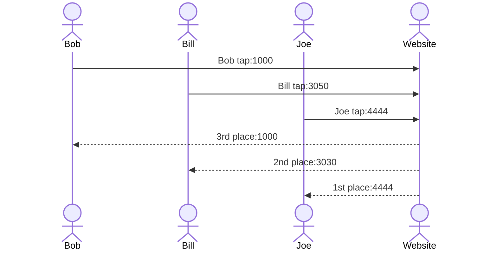

# Tap-a-Lot

[My Notes](notes.md)

A game website where you tap a button, earn points for each click, and compete with friends. You can exchange points for different button skins and backgrounds. Create an account (email and name) to store scores and skins and so your name can be ranked on the website. Rankings show ranking, name, and points (diff colors). There will be three tabs, "Tap", "Store", and "Rankings" on the bottom and a 'settings' tab in the top right corner. 

## 🚀 Specification Deliverable

### Elevator pitch

Want to play a fun game with friends to compete to see who can tap the most? Then get Tap-a-Lot, a simple, yet fun game about tapping a button and seeing whom among you can do it the most! Tap a lot of times and unlock fun button skins and backgrounds to elevate your experience. Login with your name and email to save your points and skins. See how you rank among oyur friends and everyone who has played before. 

For this deliverable I did the following. I checked the box `[x]` and added a description for things I completed.

- [x] Proper use of Markdown
- [x] A concise and compelling elevator pitch
- [x] Description of key features
- [x] Description of how you will use each technology
- [x] One or more rough sketches of your application. Images must be embedded in this file using Markdown image references.

### Design

### Key features

- Login over HTTPS
- Each tap adds a point
- Use points to buy button skins and backgrounds (will subtract from total points)
- Ability to store and use bought skins.
- People who create accounts can see other account names, points, and rankings.
- Save points, skins, and ranking using name and email

### Technologies

I am going to use the required technologies in the following ways.

- **HTML** - Four HTML pages. Use hyperlinks to move between them. One for the main page with the tapping button. Another to view and use the store to buy skins. Another to view rankings. Lastly, one to create/login and see your account.
- **CSS** - Style each page that can be used on different sceens. Uses good styling to look like a game app.
- **React** - Provides login, use points, and save taps as points.
- **Service** - Used for backend such as login accounts, make taps/points functional, rank accourding to points, and adding/subracting points.
- **DB/Login** - Store usernames, points, rankings, and 'skin' images. Accounts saved so people can save their points. 
- **WebSocket** - Every tap is saved and automatically applies to ranking for other users to see. 

## 🚀 AWS deliverable

For this deliverable I did the following. I checked the box `[x]` and added a description for things I completed.

- [x] **Server deployed and accessible with custom domain name** - [My server link](https://tapalot.click/).

## 🚀 HTML deliverable

For this deliverable I did the following. I checked the box `[x]` and added a description for things I completed.

- [ ] **HTML pages** - I did not complete this part of the deliverable.
- [ ] **Proper HTML element usage** - I did not complete this part of the deliverable.
- [ ] **Links** - I did not complete this part of the deliverable.
- [ ] **Text** - I did not complete this part of the deliverable.
- [ ] **3rd party API placeholder** - I did not complete this part of the deliverable.
- [ ] **Images** - I did not complete this part of the deliverable.
- [ ] **Login placeholder** - I did not complete this part of the deliverable.
- [ ] **DB data placeholder** - I did not complete this part of the deliverable.
- [ ] **WebSocket placeholder** - I did not complete this part of the deliverable.

## 🚀 CSS deliverable

For this deliverable I did the following. I checked the box `[x]` and added a description for things I completed.

- [ ] **Visually appealing colors and layout. No overflowing elements.** - I did not complete this part of the deliverable.
- [ ] **Use of a CSS framework** - I did not complete this part of the deliverable.
- [ ] **All visual elements styled using CSS** - I did not complete this part of the deliverable.
- [ ] **Responsive to window resizing using flexbox and/or grid display** - I did not complete this part of the deliverable.
- [ ] **Use of a imported font** - I did not complete this part of the deliverable.
- [ ] **Use of different types of selectors including element, class, ID, and pseudo selectors** - I did not complete this part of the deliverable.

## 🚀 React part 1: Routing deliverable

For this deliverable I did the following. I checked the box `[x]` and added a description for things I completed.

- [ ] **Bundled using Vite** - I did not complete this part of the deliverable.
- [ ] **Components** - I did not complete this part of the deliverable.
- [ ] **Router** - I did not complete this part of the deliverable.

## 🚀 React part 2: Reactivity deliverable

For this deliverable I did the following. I checked the box `[x]` and added a description for things I completed.

- [ ] **All functionality implemented or mocked out** - I did not complete this part of the deliverable.
- [ ] **Hooks** - I did not complete this part of the deliverable.

## 🚀 Service deliverable

For this deliverable I did the following. I checked the box `[x]` and added a description for things I completed.

- [ ] **Node.js/Express HTTP service** - I did not complete this part of the deliverable.
- [ ] **Static middleware for frontend** - I did not complete this part of the deliverable.
- [ ] **Calls to third party endpoints** - I did not complete this part of the deliverable.
- [ ] **Backend service endpoints** - I did not complete this part of the deliverable.
- [ ] **Frontend calls service endpoints** - I did not complete this part of the deliverable.
- [ ] **Supports registration, login, logout, and restricted endpoint** - I did not complete this part of the deliverable.

## 🚀 DB deliverable

For this deliverable I did the following. I checked the box `[x]` and added a description for things I completed.

- [ ] **Stores data in MongoDB** - I did not complete this part of the deliverable.
- [ ] **Stores credentials in MongoDB** - I did not complete this part of the deliverable.

## 🚀 WebSocket deliverable

For this deliverable I did the following. I checked the box `[x]` and added a description for things I completed.

- [ ] **Backend listens for WebSocket connection** - I did not complete this part of the deliverable.
- [ ] **Frontend makes WebSocket connection** - I did not complete this part of the deliverable.
- [ ] **Data sent over WebSocket connection** - I did not complete this part of the deliverable.
- [ ] **WebSocket data displayed** - I did not complete this part of the deliverable.
- [ ] **Application is fully functional** - I did not complete this part of the deliverable.
